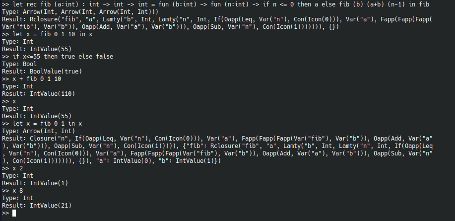

# Sub-OCaml-REPL
[](https://www.rust-lang.org/)
[](https://github.com/Neotamandua/Sub-OCaml-REPL/blob/master/LICENSE)


> Simple read–eval–print loop (REPL) for [Sub-OCaml](https://github.com/Neotamandua/Sub-Ocaml) with global persistent environment
### Example Screenshot:
[](#)

### Dependencies:
- [Sub-OCaml](https://github.com/Neotamandua/Sub-Ocaml)
```toml
[dependencies]
rustyline = "11.0.0"
anyhow = "1.0.69"

[dependencies.Sub-OCaml]
path = "Sub-OCaml" # change to your path
```